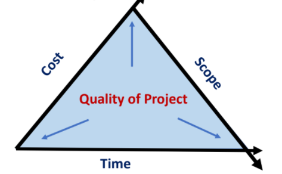

# Software Program Management Introduction

**Software Projects** are temporary projects that can be individual or collaborative. They are **carefully planned** to create a unique product or service.

These projects have certain characteristics:

- Have certain unique activities that do not repeat under similar circumstances.
- Goal specific.
- Contain a sequence of actions that result in delivering an end product.
- Time bound.

Projects are oftened constrained by **scope, time and cost**.

# Software Project Planning

Initiation and approval of the project typically happens at the end of the feasibility study.

**Planning**: It is one of the first tasks and involves the Product Manager (PM) focusing on what needs to be achieved and how.
It involves looking ahead and obtaining the resources necessary so that the project will be executed smoothly.
Outcome of the planning phase is usually a **Project Plan**.

Project plan needs to answer these questions from the **Sponsor**:

- Where does this project fit with the orgs roadmap
- What requirement does it address
- Investment required
- Risks and time to market
- Deliverables

Project plan needs to answer these questions from the **Customer**:

- Does the team understand the problem
- Cost
- Acceptance Criteria
- Future support

Project plan needs to answer these questions from the **Execution Stakeholders**:

- Lifecycle being followed
- Criteria for requirement prioritisation
- Communication mechanisms
