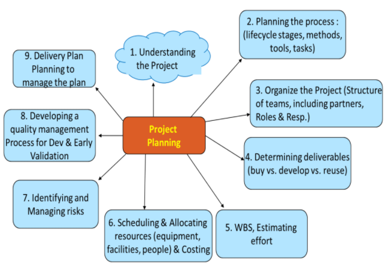

# Software Planning

### Understanding the Project

- Understand the needs of the customers, the stakeholders and the market.
- Support by results of Feasibility Study and Requirements Elicitation.

### Planning the Process

- Choosing a lifecycle.
- Choosing methods and tasks to follow during the development.
- What standards or guidelines should be met.
- Identifying tools to be used

### Organising the Project

- Determing the structure of the teams.
- Determining the structure of the organisation (flat, heirarchical, etc.).
- Setting up roles and responsibilities for each member.
- Identification of partners (localisation, sales and support, product marketing)

### Determining Deliverables

- Choosing between **Buy vs Develop vs Reuse**.

### WBS - Work Breakdown Structure

- Split projects into tasks.
- Combine taks to form specific phases. 
- Entry/Exit Criteria for each task.

### Estimation of Effort

- Can use techniques like **Delphi**, **Modified Delphi**.

##### Constructive Cost Model - CoCoMo

- **Organic**: Team size is small, have experience in similar problems, well understood problem.
- **Large**: Large team size, very complex, need people with sufficient experience.
- **Semi-detatched**: In between these two.

**Effort = ab (Kilo Lines of Code) bb Person Months**

### Scheduling and Allocating Resources

- Calendarisation of the work activities that are received from [WBS](#WBS---Work-Breakdown-Structure) and [Estimation of Effort](#Estimation-of-Effort).
